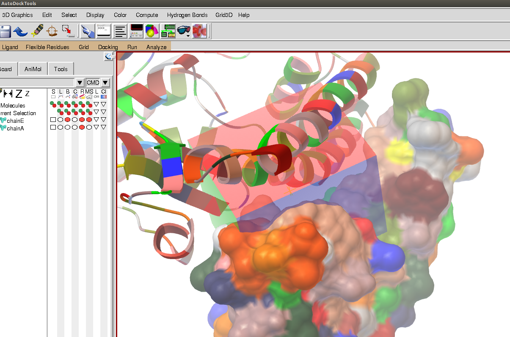

[receptors](../)

##### Sars-cov2 Spike protein
This docking run is identical to spike-1, however the gridbox is moved further along
the spike protein and focuses more on the groove where the alpha-helix of ACE2 contacts.

Receptor is chain E from 2AJF.pdb

